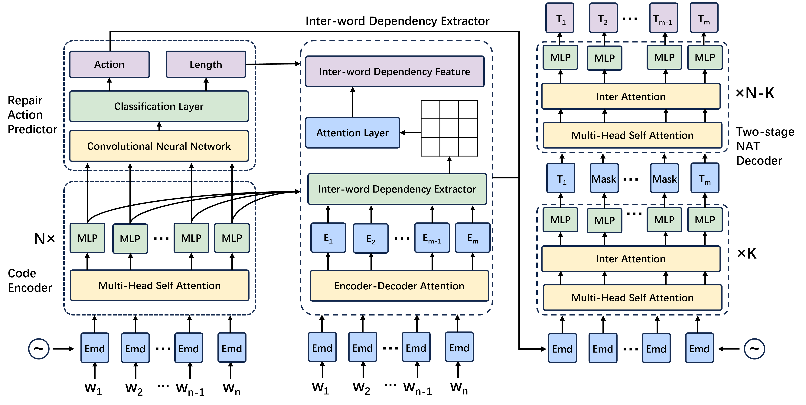

# NARRepair
A PyTorch Implementation of paper "NARRepair:Non-Autoregressive Code Generation Model for Automatic Program Repair". 
## Introduction
Recent years have witnessed a surge of research efforts on Automatic Program Repair(APR), which promises to reduce software development costs and improve software reliability. With the advancement of deep learning techniques and particularly the recent emergence of large language models (LLMs), the performance of APR techniques has reached a new level. Previous deep learning-based APR techniques basically used a sequence-to-sequence model to modify program sentences in the Autoregressive(AR) manner, which predicts future values based on past values. The use of AR manner leads to the inability of real-time repair and huge time delays for repairing real-life complex bugs which typically involves modifications to long code sequence. These two negative consequences overshadow the widespread adoption of APR techniques in real-life software development. 
To address the issues, we in this paper propose NARRepair, the first non-Autoregressive (NAR) code generation model for the APR task. NARRepair is inspired by the abundance of works in machine translation, which generate text in a NAR manner to improve the speed of model inference. However, the naive use of NAR manner in the APR task suffers from the issue of reduced patch quality. To adapt NAR manner for APR tasks, NARRepair features three major novelties. First, NARRepair is guided by repair actions to solve the problem of modifying the correct word into the wrong word. Second, NARRepair employs inter-word dependency information (based on Abstract Syntax Tree) to generate words in parallel while maintaining good fluency. Finally, NARRrepair obtains contextual information about words through two-stage decoding to improve patch accuracy. We evaluated NARRepair on the Defects4J v1.2 dataset, the Defects4J v2.0 dataset, and the QuixBugs dataset. The results show that 1) the inference speed of the NARRepair model has been increased by 5.4-11.8 times in the CPU environment and 6.2-16.1 times in the GPU environment, and 2) NARRepair has fixed 52, 34, and 16 bugs for Defect4J v1.2, Defect v2.0, and QuxiBugs respectively, which are 81\%, 84\%, and 80\% of the optimal model. The results demonstrate that our model can significantly improve the inference speed without obviously reducing the accuracy of program repair.

## Requirements
* Python >= 3.7
* Pytorch >= 1.5.0
* Fairseq >=1.0.0
* Tree-Sitter
* Transformers>=4.10.0
## Folder Structure
Our code is written based on the Fairseq framework. Here we only describe the files related to the implementation of our model. If you want to know about other files, please refer to Fairseq's documentation[https://fairseq.readthedocs.io/en/latest/index.html]
 ```bash
 ├── Dataset: data used for training and testing
 ├── fairseq: the code of fairseq from
     ├──models/nat/narrepair_nonautoregressive_transformer.py: the code of NARRepair model
     ├──parser: the code of generating AST using Tree-Sitter tool
 ├── narrepair: the code of NARRepair
     ├──narrepair/task: the code of task of NARRepair
     ├──narrepair/model: the code of NARRepair model
     ├──narrepair/criterions: the code of criterions function of NARRepair

```
## Preprocess
```
TEXT=
dict_path1=

python $EXP_HOME/preprocess.py --source-lang buggy  --target-lang fixed   \
    --task translation \
    --trainpref $TEXT/train --validpref $TEXT/valid \
    --padding-factor 8 \
    --src-with-werdur \
    --destdir defect4j-bin \
    --srcdict ${dict_path1} --tgtdict ${dict_path1} \
    --workers 60
```
## Train
```
data_dir=
save_path=
CUDA_VISIBLE_DEVICES=0,1,2,3 python3 train.py ${data_dir} --arch narrepair --noise full_mask --share-all-embeddings \
    --criterion narrepair_loss --label-smoothing 0.1 --lr 5e-5 --warmup-init-lr 1e-7 --stop-min-lr 1e-9 \
    --lr-scheduler inverse_sqrt --warmup-updates 4000 --optimizer adam --adam-betas '(0.9, 0.999)' \
    --adam-eps 1e-6 --task narrepair_task --max-tokens 50000 --weight-decay 0.01 --dropout 0.1 \
    --encoder-layers 6 --encoder-embed-dim 512 --decoder-layers 6 --decoder-embed-dim 512 --fp16 \
    --max-source-positions 6000 --max-target-positions 6000 --seed 0 --clip-norm 5 \
    --save-dir ${save_path} --src-embedding-copy --length-loss-factor 0.05 --log-interval 100 \
    --eval-bleu --eval-bleu-args '{"iter_decode_max_iter": 0, "iter_decode_with_beam": 1}' \
    --eval-tokenized-bleu --eval-bleu-remove-bpe --best-checkpoint-metric bleu \
    --maximize-best-checkpoint-metric --decoder-learned-pos --encoder-learned-pos \
    --apply-bert-init --activation-fn gelu --user-dir narrepair --mlm-layers 2 --batch-size 50 --max-epoch 100 \
    --src-with-werdur --werdur-max-predict 10
```

## Inference
```
checkpoint_path=
data_dir=
src=buggy
tgt=fixed
CUDA_VISIBLE_DEVICES=0 python3 fairseq_cli/generate.py ${data_dir} --path ${checkpoint_path} \
 --user-dir narrepair --task narrepair_task --remove-bpe --source-lang ${src} \
 --target-lang ${tgt} --max-sentences 20  --iter-decode-max-iter 0 --iter-decode-force-max-iter \
 --iter-decode-eos-penalty 0 --iter-decode-with-beam 1 --gen-subset test \
```
